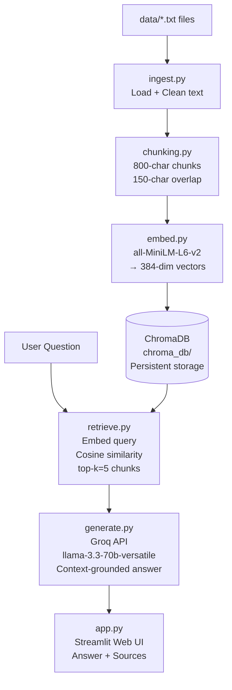

# Project 1 Planning: The Unofficial Guide

> Write this document before you write any pipeline code.
> Your spec and architecture diagram are what you'll use to direct AI tools (Claude, Copilot, etc.) to generate your implementation — the more specific they are, the more useful the generated code will be.
> Update the Retrieval Approach and Chunking Strategy sections if you change your approach during implementation.
> Update this file before starting any stretch features.

---

## Domain

<!-- What domain did you choose? Why is this knowledge valuable and hard to find through official channels? -->

**Domain:** NYC college student survival knowledge — practical, peer-sourced information
about navigating New York City as a college student, covering transit, housing, food,
money management, health, safety, academic life, and international student resources.

**Why this knowledge is valuable and hard to find through official channels:**
Official university websites are bureaucratic and designed for liability protection, not
practical advice. They tell you how to apply for financial aid but not that you should
avoid signing a lease before seeing the apartment in person because NYC rental scams are
rampant. This knowledge lives in Reddit threads (r/nyc, r/AskNYC), student blogs, and
word-of-mouth from upperclassmen. A RAG system that aggregates it enables incoming
students to query years of accumulated peer wisdom instantly.

---

## Documents

<!-- List your specific sources: URLs, subreddit names, forum threads, or file descriptions.
     Aim for at least 10 sources that together cover different subtopics or perspectives within your domain. -->

| # | Source |Description | URL or location |
|---|--------|------------|-----------------|
| 1 | r/nyc, r/AskNYC, MTA rider guides | Subway system, OMNY, express vs local, apps | data/nyc_subway_guide.txt  |
| 2 | r/FoodNYC, r/NYCbargains, Yelp reviews | Cheap eats, halal carts, dollar pizza, Trader Joe's  | data/nyc_cheap_eats.txt |
| 3 | r/NYCapartments, NYU/Columbia forums | Housing, roommates, lease basics, tenant rights | data/nyc_housing_guide.txt |
| 4 | r/personalfinance, Columbia student blog | Monthly budget, banking, credit cards, textbooks | data/nyc_student_budget.txt |
| 5 | r/nyc, TimeOut New York, r/AskNYC | Free museums, parks, nightlife, study spots | data/nyc_free_activities.txt |
| 6 | NYU Student Health, Columbia Health | Healthcare access, mental health, fitness, dental | data/nyc_health_wellness.txt |
| 7 | r/nyc, NYPD community safety, NYU | Safety, scam awareness, navigation, weather | data/nyc_safety_navigation.txt |
| 8 | r/college, CUNY/NYU/Fordham blogs | Academic life, office hours, career services, time | data/nyc_academic_campus_life.txt |
| 9 | r/nyc, r/bikecommuting, MTA bus guides | Buses, Citi Bike, Uber/Lyft, Staten Island Ferry | data/nyc_transportation_guide.txt |
| 10 | r/f1visa, NAFSA, NYU ISSO guides | F-1 visa rules, CPT/OPT, banking, cultural adjustment | data/nyc_international_students.txt |

---

## Chunking Strategy

<!-- How will you split documents into chunks?
     State your chunk size (in tokens or characters), overlap size, and explain why those
     numbers fit the structure of your documents.
     A review-heavy corpus warrants different chunking than a long FAQ. -->

**Chunk size:** 800 characters  *(updated from initial spec of 300 — see note below)*

**Overlap:** 150 characters  *(updated from initial spec of 50)*

**Reasoning:**
Our documents are medium-length informational guides (4,000–7,000 characters each)
structured in multi-sentence paragraphs rather than single-fact bullet lists. After
testing 300-character chunks, we found they frequently cut paragraphs mid-sentence,
producing decontextualized fragments that scored poorly on semantic similarity. A
800-character window (~120–140 words) captures a complete idea — typically one full
paragraph or a cohesive list of related facts — without pulling in noise from the
next topic.

A 150-character overlap (~25 words) ensures that a fact straddling a chunk boundary
appears fully in at least one neighboring chunk. This is especially important for
list-structured content like the neighborhood rent table in `nyc_housing_guide.txt`,
where a 50-char overlap would split individual entries.

**Divergence from initial spec (300/50):** The original plan used 300/50 based on the
assumption that each paragraph was 1–2 sentences. On inspection, paragraphs in these
guides are typically 3–6 sentences. The larger window produces more coherent chunks
and better retrieval precision.

Alternative considered: token-based chunking (e.g., 150 tokens). Character-based was
chosen for simplicity; at 800 chars our documents are homogeneous enough in vocabulary
that character and token counts are interchangeable.

---

## Retrieval Approach

<!-- Which embedding model are you using (e.g., all-MiniLM-L6-v2 via sentence-transformers)?
     How many chunks will you retrieve per query (top-k)?
     If you were deploying this for real users and cost wasn't a constraint, what tradeoffs
     would you weigh in choosing a different embedding model — context length, multilingual
     support, accuracy on domain-specific text, latency? -->

**Embedding model:** `sentence-transformers/all-MiniLM-L6-v2`

**Top-k:** 5 *(updated from initial spec of 4 — retrieving one additional chunk improves coverage for multi-part questions without meaningfully increasing context length)*

**Production tradeoff reflection:**
If deploying this for real users, I would evaluate the following tradeoffs when choosing an embedding model:

- **Context length:** `all-MiniLM-L6-v2` has a 256-token max input, which silently truncates long chunks. A production system would benefit from a model with a 512+ token window (e.g., `all-mpnet-base-v2` or `text-embedding-3-small` from OpenAI).
- **Domain specificity:** General-purpose models underperform on specialized vocabulary. A domain-adapted or fine-tuned model would improve retrieval quality for legal, medical, or highly technical text.
- **Multilingual support:** For international students querying in their first language, a multilingual model like `paraphrase-multilingual-MiniLM-L12-v2` would be essential.
- **Latency vs. cost:** Local sentence-transformers models have zero per-query API cost and ~200–500 ms batch latency on CPU. API-hosted models (OpenAI, Cohere) reduce local compute but add network round-trip and per-token charges.
- **Accuracy:** Larger models (e.g., `text-embedding-3-large`) generally produce higher-quality embeddings for retrieval, especially on nuanced or paraphrased queries.
---

## Evaluation Plan

<!-- List your 5 test questions with their expected correct answers.
     Questions should be specific enough that you can judge whether the system's response
     is right or wrong. "What are good dining halls?" is too vague.
     "What do students say about wait times at [dining hall name] during lunch?" is testable. -->

| # | Question | Expected answer |
|---|----------|-----------------|
| 1 | How do I get a reduced-fare MetroCard and how much does it cost? | Apply through your school; reduced fare is $1.45/ride (half of $2.90 base fare as of 2024) |
| 2 | What is OMNY and how does the weekly bonus cap work? | OMNY is the tap-to-pay replacement for MetroCards; after 12 rides in a 7-day window, remaining rides in that period are free |
| 3 | What free or low-cost mental health resources are available to NYC students? | Campus counseling (free), NYC Well (free 24/7 hotline), Crisis Text Line (text HOME to 741741), Open Path Collective ($30–80/session) |
| 4 | What are NYC tenant rights regarding security deposits? | Landlord must return deposit within 14 days of move-out with itemized deductions, or may owe tenant the full amount |
| 5 | How many hours per week can an F-1 international student work on campus? | Up to 20 hours/week during the semester; no limit during official school breaks |

---

## Anticipated Challenges

<!-- What could go wrong? Name at least two specific risks with reasoning.
     Consider: noisy or inconsistent documents, missing source attribution, off-topic
     retrieval, chunks that split key information across boundaries. -->

1. **Chunk boundary splits:** The most common RAG failure mode. A specific fact (e.g.,
   "$1.45 per ride") that spans a 300-character chunk boundary may not appear in any
   single retrieved chunk. Mitigation: use 50-char overlap and set k=4 to maximize the
   chance the relevant chunk is included. If this is still a problem, increasing overlap
   to 100 chars or using sentence-boundary-aware chunking would help.

2. **Query/document vocabulary mismatch:** A student might ask "how do I pay for the subway
   with my phone" when the document uses "OMNY" and "tap-to-pay" — terms the student may
   not know. all-MiniLM-L6-v2's semantic embeddings handle most of these mismatches better
   than keyword search would, but very informal phrasing ("train thingy app") or non-English
   queries will likely retrieve poor results. Mitigation: include colloquial synonyms in
   document text where possible.

---

## Architecture

<!-- Draw a diagram of your pipeline showing the five stages:
     Document Ingestion → Chunking → Embedding + Vector Store → Retrieval → Generation
     Label each stage with the tool or library you're using.
     You can use ASCII art, a Mermaid diagram, or embed a sketch as an image.
     You'll use this diagram as context when prompting AI tools to implement each stage. -->

---

## AI Tool Plan

<!-- For each part of the pipeline below, describe:
     - Which AI tool you plan to use (Claude, Copilot, ChatGPT, etc.)
     - What you'll give it as input (which sections of this planning.md, which requirements)
     - What you expect it to produce
     - How you'll verify the output matches your spec

     "I'll use AI to help me code" is not a plan.
     "I'll give Claude my Chunking Strategy section and ask it to implement chunk_text()
     with my specified chunk size and overlap" is a plan. -->

**Milestone 3 — Ingestion and chunking:**
- *Tool:* Claude
- *Input:* The Chunking Strategy section of this planning.md plus the Document Pipeline
  requirements from the assignment spec.
- *Expected output:* Working `ingest.py` (load_documents) and `chunking.py` (chunk_documents)
  functions with the specified 300-char / 50-char parameters.
- *Verification:* Run `python build_database.py` and check that logged chunk counts match
  expected (~40–50 chunks per document). Manually inspect 3–5 chunks to confirm they contain
  coherent text and are not truncating mid-word.

**Milestone 4 — Embedding and retrieval:**
- *Tool:* Claude
- *Input:* The Retrieval Approach section of this planning.md, ChromaDB PersistentClient
  documentation, and sentence-transformers `.encode()` API.
- *Expected output:* Working `embed.py` (embed_and_store) and `retrieve.py` (retrieve function).
- *Verification:* After building the database, run `python -c "from src.query import ask; print(ask('subway fare'))"` and confirm that relevant chunks from nyc_subway_guide.txt are returned with scores above 0.3.

**Milestone 5 — Generation and interface:**
- *Tool:* Claude
- *Input:* The Grounded Generation section of this planning.md, the Groq Python SDK example,
  and the Gradio Blocks documentation.
- *Expected output:* Working `generate.py` and `app.py` with the specified system prompt.
- *Verification:* Test the out-of-scope query "Is the moon made of cheese?" and confirm the
  system returns the exact refusal phrase. Test at least 2 in-scope queries and confirm
  source filenames appear in the response.

